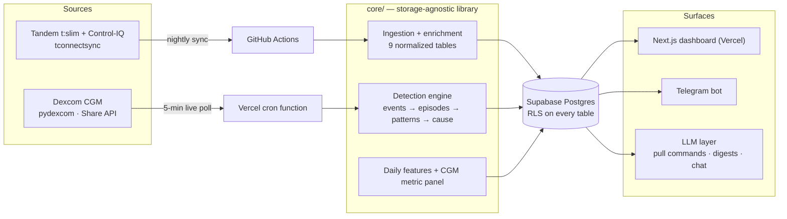

# T1D Engine

A personal data intelligence system for type 1 diabetics. Continuous glucose and insulin-pump data is pulled into the model and analyzed across two paths: specialized real-time alerts and a long view of the patterns that the device software does not surface.

<!-- TODO: hero image goes here — a dashboard screenshot or a short GIF of the day view is the strongest thing you can put at the top for the application. -->

When the live glucose curve climbs the way an unbolused meal does, the system sends a text within a few minutes:

> **T1D Engine** · 1:12 PM
> Glucose climbed from 128 to 173 mg/dL over the last 25 minutes. If that was a meal, it may still need a bolus.

That alert is initialized at every instance of a missed meal bolus. The rest of the system turns the accumulated history into a readable and actionable display.

## Background

A Dexcom sensor reports a glucose reading every five minutes, and a Tandem pump running Control-IQ logs every basal adjustment, bolus, alarm, and site change. For one person, that is ~189,114 data points a year. However, the software that comes with the device hands this back only as a time-in-range percentage with a two-week average curve.

It does not look across weeks at slower shifts or sensitivity changes. A diabetic is then left to catch those things on their own, with help from a brief endocrinologist visit every few months. T1D Engine does that work continuously: it is built to run over the data of any user of a Dexcom and Tandem, reporting and analyzing on identifiable trends (it will never recommend a dose, or level of insulin delivery.)

## What it does

The system runs several jobs over the same data. A live loop reads the Dexcom feed and sends a missed-meal alert, like the one above, within minutes. An overnight batch computes the full CGM metric panel and renders it in a Next.js dashboard. A detection engine reconstructs episodes and surfaces recurring multi-week patterns, and a sensitivity tracker estimates how insulin settings drift over time. A Telegram bot answers questions on demand and sends daily and weekly digests, backed by an LLM that stays off the real-time alert path.

## Detection and metrics

The detection engine is built in four layers, ordered by the accuracy level of each layer's output.

| Layer | Analysis |
|---|---|
| **Event** | Live, trailing-window only, tolerant of false positives |
| **Episode** | Retrospective, reconstructs the full arc of a meal, low, or excursion |
| **Pattern** | Aggregate, surfaces drift and recurring behavior |
| **Cause** | Attribution, the hardest layer, integrates LLM insights|

The single shared primitive under every layer is a windowing function that returns the glucose slice around an anchor, where the live case is just the zero-lookahead version of the retrospective one.

Machine learning enters in two places. The pattern layer is unsupervised: KMeans over daily feature vectors groups similar days, and glucotype-style clustering groups shorter windows by the shape of the glucose curve rather than its average. The event and episode detectors start as heuristics by design. A nightly pass scores each detection against the pump's recorded boluses and carbs, which measures precision and recall and produces a labeled dataset. Supervised models train on that dataset and take over from the heuristics as it grows, so the ordering is deliberate: the heuristics generate the labels that make training possible.

### Analytics and metrics grounded in clinical research

The overnight metric panel computes time in range and time in tight range, GMI, time above and below range, the low and high blood-glucose risk indices, coefficient of variation against its clinical threshold, and the Glycemia Risk Index as the headline number, shown with percentile bands and an ambulatory-glucose-profile view.

The metric panel and the analytical layers are built on established clinical and open-source work as follows:

- **Time in range and the core CGM panel** follow the international consensus targets, which define the standard ranges and the reporting conventions the dashboard uses. Battelino et al., *Clinical Targets for Continuous Glucose Monitoring Data Interpretation*, **Diabetes Care** 2019;42(8):1593–1603. https://doi.org/10.2337/dci19-0028
- **The Glycemia Risk Index (GRI)**, used as the default single-number summary of overall glycemic quality, combines weighted hypo- and hyperglycemia components validated against clinician rankings. Klonoff et al., *A Glycemia Risk Index of Hypoglycemia and Hyperglycemia for Continuous Glucose Monitoring Validated by Clinician Ratings*, **Journal of Diabetes Science and Technology** 2023;17(5):1226–1242. https://doi.org/10.1177/19322968221085273
- **The Glucose Management Indicator (GMI)** estimates a lab-equivalent A1C from mean CGM glucose. Bergenstal et al., *Glucose Management Indicator (GMI): A New Term for Estimating A1C From Continuous Glucose Monitoring*, **Diabetes Care** 2018;41(11):2275–2280. https://doi.org/10.2337/dc18-1581
- **The Low and High Blood Glucose Indices (LBGI/HBGI)** weight excursions by clinical risk rather than treating all deviations equally, from Kovatchev's risk-analysis framework. Kovatchev et al., *Evaluation of a New Measure of Blood Glucose Variability in Diabetes*, **Diabetes Care** 2006;29(11):2433–2438. https://doi.org/10.2337/dc06-1085
- **Glucotype-style clustering** groups time windows by the shape of the glucose curve rather than its average, which is the basis for the pattern-characterization layer. Hall et al., *Glucotypes Reveal New Patterns of Glucose Dysregulation*, **PLoS Biology** 2018;16(7):e2005143. https://doi.org/10.1371/journal.pbio.2005143
- **The insulin-sensitivity and settings-observation report** adapts the deviation-attribution approach pioneered by the open-source Autotune tool, surfaced as observation rather than applied automatically. OpenAPS Autotune: https://openaps.readthedocs.io/en/latest/docs/Customize-Iterate/autotune.html

Signal-complexity analysis over glucose windows uses entropy-based measures from physiologic time-series analysis, and the volatility-regime and dawn-versus-rebound analyses build on the same windowing foundation as the meal-response work.

## Architecture

The system is a storage-agnostic core library with thin deployment shells around it. That separation enables a user to utilize the same detection and metric code in a local version running on their own machine, or in the cloud for a user who wants live detection.

Everything under `core/` is a set of pure functions over normalized DataFrames and a typed config object. Reads and writes go through a `Storage` protocol with parquet, Postgres, and in-memory implementations behind it. Detection takes data and configuration and returns data, which keeps it testable and portable.

Ingestion turns the raw device feeds into nine normalized tables, and an enrichment stage adds the domain logic. It categorizes each bolus and separates a forced site change after a battery shutdown from a real infusion-set rotation. It groups occlusions into suspected site failures and flags Control-IQ automated corrections so they are not counted as meal coverage.

The cloud deployment runs the dashboard on Next.js and Vercel, stores data in Supabase Postgres with auth, takes inbound Telegram commands through a webhook, drives the live loop with an external cron service hitting a Vercel function every five minutes, and syncs the pump nightly through a GitHub Actions workflow. 

## Notes

The core has a large test suite, including a contract suite that every storage backend passes identically, so swapping parquet for Postgres or for the in-memory store changes nothing a caller can see. Detection is pure and deterministic, the clustering is seeded so results reproduce, a version guard refuses to read on-disk data against decode logic it no longer matches, and a `doctor` command reports the state of the pipeline at a glance. The local version can run all analyses and detection; however, it can be storage-intensive and cannot support live alerts. 

---

*This was built as a personal project by someone living with type 1 diabetes, for their own data first. It is not a medical device, it is not medical advice, and it is not affiliated with Dexcom, Tandem, or any device manufacturer.*

