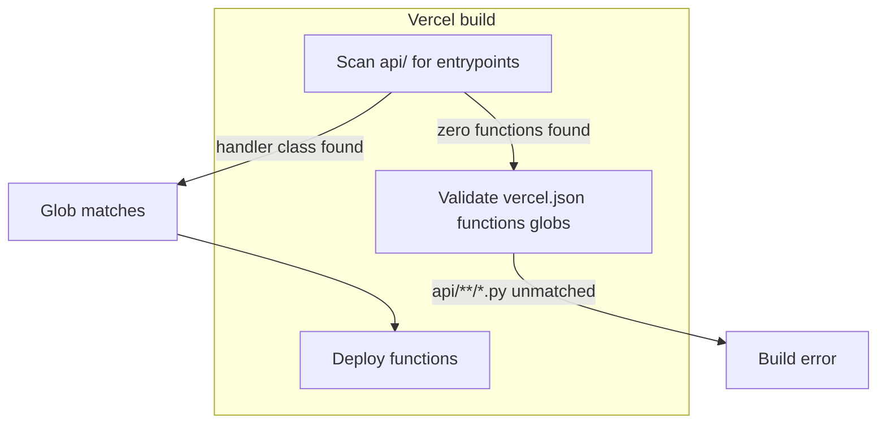
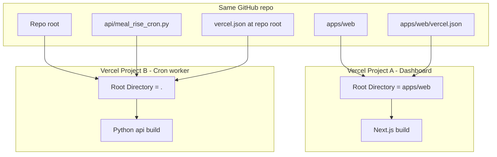

# Cron Worker Vercel Deploy Fix

> **For agentic workers:** REQUIRED SUB-SKILL: Use [executing-plans](file:///Users/ashtonmeyer-bibbins/.cursor/plugins/cache/cursor-public/superpowers/b7a8f76985f1e93e75dd2f2a3b424dc731bd9d37/skills/executing-plans/SKILL.md) or [subagent-driven-development](file:///Users/ashtonmeyer-bibbins/.cursor/plugins/cache/cursor-public/superpowers/b7a8f76985f1e93e75dd2f2a3b424dc731bd9d37/skills/subagent-driven-development/SKILL.md). Each task uses TDD (red → green → refactor). REQUIRED before claiming done: [verification-before-completion](file:///Users/ashtonmeyer-bibbins/.cursor/plugins/cache/cursor-public/superpowers/b7a8f76985f1e93e75dd2f2a3b424dc731bd9d37/skills/verification-before-completion/SKILL.md).

**Goal:** Worker Vercel project deploys without "Unmatched function pattern", serves `/api/meal_rise_cron`, and can import `core/`, `detection/`, `apps/personal/` at runtime.

**Architecture:** Two **separate Vercel projects** in one Git repo. Frontend production is untouched: it keeps Root Directory [`apps/web`](apps/web) and [`apps/web/vercel.json`](apps/web/vercel.json) only. Worker uses repo root + [`api/`](api/) + root [`vercel.json`](vercel.json). Vercel never merges configs across projects — each project's Root Directory is its filesystem root for build and routing.

**Frontend safety rule:** No edits under `apps/web/` except optional README cross-links (no `vercel.json`, `package.json`, `next.config`, routes, or middleware changes).

**Tech Stack:** Vercel Python runtime (`class handler(BaseHTTPRequestHandler)`), `requirements.txt`, pytest, `vercel` CLI.

**Save plan copy to:** `docs/superpowers/plans/2026-05-28-cron-worker-vercel-deploy.md` (when implementing).

---

## Root cause (confirmed)



| Issue | Status |
|-------|--------|
| `functions` glob `api/**/*.py` | Correct per [Vercel docs](https://vercel.com/docs/errors/error-list#unmatched-function-pattern) |
| `def handler(request) -> dict` on `origin/main` | **Not discovered** — must be `class handler(BaseHTTPRequestHandler)` |
| Root Directory `apps/cron_worker` + imports from `../../core` | **Runtime bundle gap** — parent paths not available; `includeFiles: ../../...` ineffective |

Uncommitted work on branch (not on `origin/main`): [`apps/cron_worker/api/meal_rise_cron.py`](apps/cron_worker/api/meal_rise_cron.py) + [`tests/detection/test_meal_rise_cron_handler.py`](tests/detection/test_meal_rise_cron_handler.py) already implement the correct entrypoint — must be committed as part of this work.

**Vercel MCP:** Only `mcp_auth` is available in this workspace; use **Vercel CLI** (`vercel build`, `vercel logs`, dashboard deployment logs) for deploy verification.

---

## Target layout

```text
t1d-engine/                          # Worker project Root Directory = "."
├── vercel.json                      # Worker-only (web project uses apps/web/)
├── api/
│   └── meal_rise_cron.py            # Vercel function (moved from apps/cron_worker/api/)
├── apps/
│   ├── web/                         # Separate Vercel project (unchanged)
│   └── cron_worker/
│       ├── requirements.txt
│       ├── pyproject.toml
│       └── README.md                # Updated deploy instructions
├── core/, detection/, config/, apps/personal/  # Bundled when root = repo
└── tests/
    ├── detection/test_meal_rise_cron_handler.py
    └── apps/test_cron_worker_deploy_contract.py   # NEW
```

**Dashboard (worker project):**

| Setting | Value |
|---------|--------|
| Root Directory | `.` (clear `apps/cron_worker`) |
| Framework Preset | **Other** |
| Production URL path | `/api/meal_rise_cron` (unchanged for cron-job.org) |

**Dashboard (frontend / production — do not change):**

| Setting | Value |
|---------|--------|
| Root Directory | `apps/web` (must stay) |
| Framework Preset | **Next.js** |
| Config file used | [`apps/web/vercel.json`](apps/web/vercel.json) only |
| Routes | `app/api/*` (e.g. `/api/cron/meal-rise` health) — **not** repo-root `api/` |

---

## Frontend isolation (production must not break)



### Why the frontend build is unaffected

1. **Root Directory scoping** — With Root Directory `apps/web`, Vercel treats `apps/web` as the project root. It does **not** read repo-root [`vercel.json`](vercel.json), does **not** deploy repo-root [`api/`](api/), and does **not** run `pip install` from worker `requirements.txt`.
2. **Separate configs** — [`apps/web/vercel.json`](apps/web/vercel.json) stays minimal (`$schema` only). Root `vercel.json` `functions` / `installCommand` apply **only** to the worker project.
3. **No route collision** — Next.js owns `apps/web/app/api/**`. Worker owns repo-root `api/meal_rise_cron.py` on a **different hostname** (second Vercel project).
4. **excludeFiles is worker-only** — `apps/web/**` in root `excludeFiles` shrinks the **Python function bundle**; it does not remove or alter files from the Next.js build (different project, different artifact).
5. **Shared code is read-only for web** — Moving the handler does not change `apps/web` source. `core/` / `detection/` remain Python-only; the Next.js app does not import them at build time.

### Files that must NOT change (frontend)

- [`apps/web/vercel.json`](apps/web/vercel.json)
- [`apps/web/package.json`](apps/web/package.json), lockfile, `next.config.*`
- [`apps/web/middleware.ts`](apps/web/middleware.ts), `app/**`, `lib/**`
- Do **not** add repo-root `api/` references into the web project

### Allowed web changes

- [`apps/web/README.md`](apps/web/README.md) — document worker Root Directory `.` and two-project setup (docs only)

### Contract tests for isolation (add in Phase 1)

Add to [`tests/apps/test_cron_worker_deploy_contract.py`](tests/apps/test_cron_worker_deploy_contract.py):

6. `test_web_vercel_json_has_no_python_functions` — parse `apps/web/vercel.json`; assert no `functions` key (or no keys matching `api/**/*.py`).
7. `test_root_vercel_json_excludes_web_from_python_bundle` — root `vercel.json` `functions["api/**/*.py"].excludeFiles` contains `apps/web/**`.
8. `test_no_meal_rise_handler_under_apps_web` — `apps/web/api/meal_rise_cron.py` must not exist (prevents accidental reintroduction).

Optional CI guard (if desired): a small script or pytest that fails if `apps/web/vercel.json` gains a `functions` block — only add if you want belt-and-suspenders beyond tests.

---

## Phase 1 — TDD: deployment contract tests (RED first)

**Files:**
- Create: [`tests/apps/test_cron_worker_deploy_contract.py`](tests/apps/test_cron_worker_deploy_contract.py)

**Tests to add (all fail until Phase 2):**

1. `test_api_meal_rise_cron_exists_at_repo_root` — `api/meal_rise_cron.py` exists (not under `apps/cron_worker/api/`).
2. `test_root_vercel_json_functions_pattern_matches_handler` — parse root `vercel.json`; key `api/**/*.py` exists; at least one `api/**/*.py` file on disk.
3. `test_meal_rise_cron_exports_handler_class` — load module; `issubclass(handler, BaseHTTPRequestHandler)`; no top-level `def handler` (inspect `type(getattr(mod, "handler"))`).
4. `test_meal_rise_cron_repo_root_on_sys_path` — after import, `str(repo_root)` in `sys.path` where `repo_root == Path(__file__).resolve().parents[2]` (handler uses `parents[1]` from `api/meal_rise_cron.py`).
5. `test_web_vercel_json_has_no_python_functions` — see Frontend isolation above.
6. `test_root_vercel_json_excludes_web_from_python_bundle`
7. `test_no_meal_rise_handler_under_apps_web`

Run (expect RED):

```bash
uv run pytest tests/apps/test_cron_worker_deploy_contract.py -q
```

Keep existing handler behavior tests in [`tests/detection/test_meal_rise_cron_handler.py`](tests/detection/test_meal_rise_cron_handler.py) — update `_CRON_MODULE_PATH` to `repo_root / "api" / "meal_rise_cron.py"` (RED until move).

---

## Phase 2 — Implement layout (GREEN)

### Task 2a: Move handler to repo-root `api/`

- **Move** [`apps/cron_worker/api/meal_rise_cron.py`](apps/cron_worker/api/meal_rise_cron.py) → [`api/meal_rise_cron.py`](api/meal_rise_cron.py)
- **Fix** `_REPO_ROOT`: `Path(__file__).resolve().parents[1]` (was `parents[3]` for nested path)
- **Delete** empty `apps/cron_worker/api/` directory

### Task 2b: Root `vercel.json` (worker project)

Create [`vercel.json`](vercel.json) at repo root:

```json
{
  "$schema": "https://openapi.vercel.sh/vercel.json",
  "installCommand": "pip install -r apps/cron_worker/requirements.txt",
  "functions": {
    "api/**/*.py": {
      "maxDuration": 60,
      "excludeFiles": "{apps/web/**,node_modules/**,tests/**,docs/**,data/**,test_data/**,research/**,.venv/**,**/*.parquet,**/*.csv}"
    }
  }
}
```

- **Remove** [`apps/cron_worker/vercel.json`](apps/cron_worker/vercel.json) to avoid confusion if someone sets wrong Root Directory.

### Task 2c: Update tests and docs

- Update [`tests/detection/test_meal_rise_cron_handler.py`](tests/detection/test_meal_rise_cron_handler.py) path to `api/meal_rise_cron.py`
- Update [`apps/cron_worker/README.md`](apps/cron_worker/README.md): Root Directory `.`, root `vercel.json`, troubleshooting (minimal `functions` block test)
- Update [`apps/web/README.md`](apps/web/README.md) + [`docs/updates/2026-05-28-cron-job-org-worker.md`](docs/updates/2026-05-28-cron-job-org-worker.md) with new deploy steps
- Add dated entry: `docs/updates/2026-05-28-cron-worker-vercel-root-layout.md`

Run (expect GREEN):

```bash
uv run pytest tests/apps/test_cron_worker_deploy_contract.py tests/detection/test_meal_rise_cron_handler.py -q
uv run pytest -q   # full suite regression
```

---

## Phase 3 — Staged deploy verification (no TDD; evidence required)

Use [verification-before-completion](file:///Users/ashtonmeyer-bibbins/.cursor/plugins/cache/cursor-public/superpowers/b7a8f76985f1e93e75dd2f2a3b424dc731bd9d37/skills/verification-before-completion/SKILL.md).

### Step 3a: Dashboard preflight (manual)

**Worker project only** (do not open web project settings unless verifying):

1. Root Directory → `.` (save)
2. Framework Preset → **Other**
3. Env vars unchanged (per README)

**Web / frontend project (verify unchanged, do not edit):**

1. Root Directory still `apps/web`
2. Framework Preset still **Next.js**
3. Note latest **successful production** deployment ID / URL before worker deploy (baseline)

### Step 3b: Minimal config deploy (isolate discovery)

Temporarily deploy with root `vercel.json` containing only `$schema` + `installCommand` (no `functions` block). If this fails, problem is still entrypoint/framework/root — stop and inspect build log.

### Step 3c: Full config deploy

Restore `functions.api/**/*.py` + `excludeFiles`. Build must pass (no unmatched pattern).

### Step 3d: CLI / logs (if linked)

From repo root (after `vercel link` to worker project):

```bash
vercel pull --yes
vercel build
# After production/preview deploy:
vercel logs <deployment-url> --follow
```

### Step 3e: HTTP smoke tests

```bash
# 401 without auth
curl -si "https://<worker>.vercel.app/api/meal_rise_cron"

# 200 with auth (or 500 with explicit exit_code from pipeline)
curl -si -H "Authorization: Bearer $CRON_SECRET" \
  "https://<worker>.vercel.app/api/meal_rise_cron"
```

**Success criteria:**

| Check | Expected |
|-------|----------|
| Build | No "Unmatched function pattern" |
| Auth | `401` without Bearer |
| Happy path | `200` + `{"ok":true,"exit_code":0}` (or documented non-zero) |
| Import errors | No `ModuleNotFoundError` for `core` / `apps.personal` in function logs |

### Step 3f: cron-job.org

Confirm URL still `https://<worker>/api/meal_rise_cron` with `Authorization: Bearer <CRON_SECRET>`.

### Step 3g: Frontend production regression (required)

After pushing the same commit that deploys the worker:

1. **Vercel dashboard (web project)** — New deployment for the commit should **succeed** (Next.js build). Compare to baseline; no new errors referencing repo-root `api/` or Python.
2. **Local web tests** (unchanged app code):
   ```bash
   npm -C apps/web test
   ```
3. **Production smoke** (existing dashboard URL):
   - App loads (home or `/day/...`)
   - Health cron route still works: `GET /api/cron/meal-rise` with Bearer → `200`, `mode: health_only`
   - Auth/session flows unchanged (no 401 on non-API pages)

**Deploy order recommendation:** Merge/deploy commit → confirm **web production green first** (or in parallel) → then confirm worker green. If worker deploy fails, **web production must remain on previous deployment** (Vercel keeps last good production).

**If web build breaks on the same commit** (unexpected): revert worker-only files in a follow-up commit or disable auto-deploy on worker project until fixed — root cause would be accidental `apps/web` edit; contract tests should prevent this.

---

## Phase 4 — Fallback (only if repo-root blocked)

If you cannot set worker Root Directory to `.` (org policy, etc.):

1. Revert to `apps/cron_worker` root
2. Add [`scripts/bundle_cron_worker.sh`](scripts/bundle_cron_worker.sh) copying `core/`, `detection/`, `config/`, `apps/personal/`, `apps/__init__.py` into `apps/cron_worker/_bundle/`
3. Set `installCommand`: `bash scripts/bundle_cron_worker.sh && pip install -r requirements.txt`
4. Point handler imports at bundled paths

Not the default path — only if Phase 3 blocked.

---

## Commit strategy

1. `test: add cron worker Vercel deploy contract tests`
2. `fix: move meal-rise handler to repo-root api for Vercel discovery`
3. `docs: update cron worker deploy for repo-root Vercel project`

Do not commit `.cursor/settings.json`.

---

## Risk notes

| Risk | Mitigation |
|------|------------|
| Root `vercel.json` picked up by web project | Impossible if web Root Directory = `apps/web`; contract test on `apps/web/vercel.json` |
| Repo-root `api/` shadows Next.js API routes | Only on worker hostname; web project never sees `../api/` |
| Git push triggers both deploys | Web build uses only `apps/web/**`; contract tests + Step 3g |
| Large Python bundle | `excludeFiles` includes `apps/web/**`; monitor 500MB limit |
| Accidental Next.js preset on worker | Framework = Other on worker only |
| Editor runs `vercel` from wrong directory | Document: link CLI per project; web → `cd apps/web && vercel link` |
